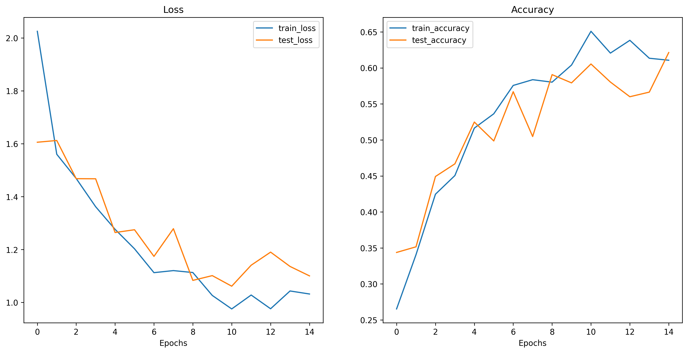

# Vision Transformer (ViT) Implementation from Scratch

This repository contains a PyTorch implementation of the Vision Transformer (ViT) model built from scratch. The project demonstrates the application of transformers to computer vision tasks, specifically for garbage classification.



## Project Overview

The Vision Transformer (ViT) approach treats image classification as a sequence prediction problem, by splitting images into patches and processing them as tokens through a transformer encoder. This implementation follows the architecture described in the ["An Image is Worth 16x16 Words: Transformers for Image Recognition at Scale"](https://arxiv.org/abs/2010.11929) paper by Dosovitskiy et al.

### Features

- Complete from-scratch implementation of ViT architecture components
- Multiple training approaches (pure training, gradient clipping, learning rate scheduler)
- Various optimizer comparisons (Adam, SGD, RMSprop)
- Comprehensive experiment tracking and visualization
- Application to garbage classification as a real-world example

## Repository Structure

```
ViT-Implementation/
│
├── Models/                      # Core ViT model components
│   ├── MLP.py                   # Multi-Layer Perceptron implementation
│   ├── MSA.py                   # Multi-Head Self-Attention module
│   ├── Patcher.py               # Image patching and embedding
│   ├── TransformerEncoder.py    # Transformer encoder block
│   └── ViT.py                   # Complete Vision Transformer implementation
│
├── Utils/                       # Utility functions
│   ├── data_loader.py           # Data loading and preprocessing
│   ├── helper_functions.py      # Helper functions for saving results
│   └── train.py                 # Training implementations
│
├── Data/                        # Dataset directory
│   └── Garbage classification   # Garbage classification dataset
│
├── Experiments/                 # Experiment results
│   ├── Pure_Training/           # Standard training approach
│   ├── Gradient_Clipping/       # Training with gradient clipping
│   └── Scheduler/               # Training with learning rate scheduler
│
├── training_pipeline.py         # Main training pipeline script
├── run_tests.py                 # Tests for ViT components
└── trials.ipynb                 # Notebook for patching and dimension analysis
```

## Model Architecture

The Vision Transformer consists of the following components:

1. **Patcher**: Splits images into fixed-size patches and performs linear embedding
2. **Positional Embedding**: Adds position information to patch embeddings
3. **Transformer Encoder**: Series of self-attention and MLP blocks with residual connections
4. **Multi-Head Self-Attention (MSA)**: Enables the model to attend to different parts of the input
5. **MLP Block**: Feed-forward network for feature transformation
6. **Classification Head**: Final layer for class prediction

## Training Approaches

The repository includes three training implementations:

1. **Pure Training**: Standard training procedure with fixed hyperparameters
2. **Gradient Clipping**: Stabilizes training by preventing gradient explosions
3. **Learning Rate Scheduler**: Implements a warmup and decay schedule for better convergence

Each approach is tested with multiple optimizers (Adam, SGD, RMSprop) to evaluate performance differences.

## Usage

### Installation

```bash
git clone https://github.com/yourusername/ViT-Implementation.git
cd ViT-Implementation
pip install -r requirements.txt
```

### Training

To run the full training pipeline with all experiments:

```bash
python training_pipeline.py
```

For specific experiments, you can modify the `experiments` dictionary in `training_pipeline.py`.

### Testing Components

```bash
python run_tests.py
```

## Results

Training results including accuracy and loss curves are stored in the Experiments directory. Each experiment folder contains:

- Accuracy and loss curves (PNG format)
- Trained model weights (.pth files)
- Training metrics (JSON format)

## Future Work

- Implement additional attention mechanisms
- Explore hybrid CNN-Transformer architectures
- Add support for additional datasets
- Implement more advanced augmentation strategies
- Performance optimization for large-scale training

## References

1. Dosovitskiy, A., et al. (2020). An Image is Worth 16x16 Words: Transformers for Image Recognition at Scale. [arXiv:2010.11929](https://arxiv.org/abs/2010.11929)
2. Vaswani, A., et al. (2017). Attention Is All You Need. [arXiv:1706.03762](https://arxiv.org/abs/1706.03762)

## License

This project is licensed under the MIT License - see the LICENSE file for details.
