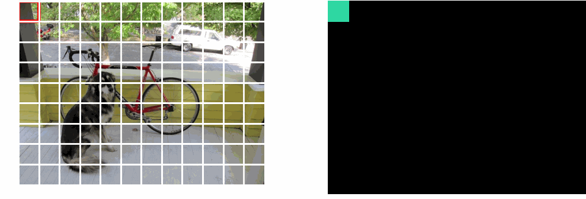
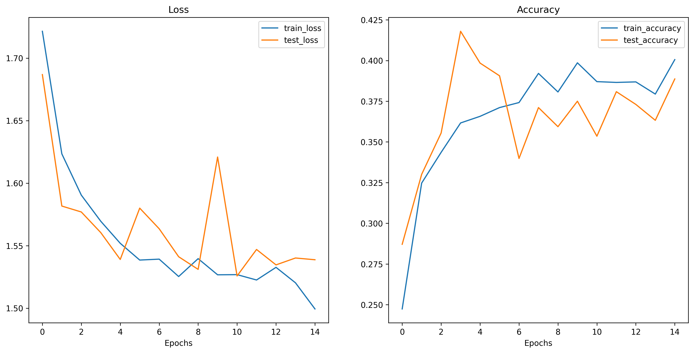

# Vision Transformer (ViT) Implementation from Scratch

This repository contains a PyTorch implementation of the Vision Transformer (ViT) model built from scratch. The project demonstrates the application of transformers to computer vision tasks, specifically for garbage classification.



## Project Overview

The Vision Transformer (ViT) approach treats image classification as a sequence prediction problem, by splitting images into patches and processing them as tokens through a transformer encoder. This implementation follows the architecture described in the ["An Image is Worth 16x16 Words: Transformers for Image Recognition at Scale"](https://arxiv.org/abs/2010.11929) paper by Dosovitskiy et al.

### Features

- Complete from-scratch implementation of ViT architecture components
- Multiple training approaches (pure training, gradient clipping, learning rate scheduler)
- Various optimizer comparisons (Adam, SGD, RMSprop)
- Comprehensive experiment tracking and visualization
- Application to garbage classification as a real-world example

## Repository Structure

```
ViT-Implementation/
│
├── Models/                      # Core ViT model components
│   ├── MLP.py                   # Multi-Layer Perceptron implementation
│   ├── MSA.py                   # Multi-Head Self-Attention module
│   ├── Patcher.py               # Image patching and embedding
│   ├── TransformerEncoder.py    # Transformer encoder block
│   └── ViT.py                   # Complete Vision Transformer implementation
│
├── Utils/                       # Utility functions
│   ├── data_loader.py           # Data loading and preprocessing
│   ├── helper_functions.py      # Helper functions for saving results
│   └── train.py                 # Training implementations
│
├── Data/                        # Dataset directory
│   └── Garbage classification   # Garbage classification dataset
│
├── Experiments/                 # Experiment results
│   ├── Pure_Training/           # Standard training approach
│   ├── Gradient_Clipping/       # Training with gradient clipping
│   └── Scheduler/               # Training with learning rate scheduler
│
├── training_pipeline.py         # Main training pipeline script
├── run_tests.py                 # Tests for ViT components
└── trials.ipynb                 # Notebook for patching and dimension analysis
```

## Model Architecture

The Vision Transformer consists of the following components:

1. **Patcher**: Splits images into fixed-size patches and performs linear embedding
2. **Positional Embedding**: Adds position information to patch embeddings
3. **Transformer Encoder**: Series of self-attention and MLP blocks with residual connections
4. **Multi-Head Self-Attention (MSA)**: Enables the model to attend to different parts of the input
5. **MLP Block**: Feed-forward network for feature transformation
6. **Classification Head**: Final layer for class prediction

## Experiments & Results

This project explores different training strategies and optimizers for Vision Transformers. Each experiment is designed to evaluate specific aspects of model training and optimization.

### Experiment Overview

| Experiment | Description | Parameters |
|------------|-------------|------------|
| Pure Training | Standard training procedure | Epochs: 15, Batch Size: 32 |
| Gradient Clipping | Prevents gradient explosions | Max Gradient Norm: 1.0 |
| Learning Rate Scheduler | Warmup and decay schedule | Warmup Steps: 10,000 |

For each experiment, three optimizers were evaluated:
- **Adam**: Adaptive learning rate optimization algorithm
- **SGD**: Stochastic Gradient Descent with momentum (0.9)
- **RMSprop**: Root Mean Square Propagation optimizer

All optimizers used an initial learning rate of 3e-4.

### Pure Training Results

Standard training with fixed hyperparameters provides a baseline for comparison.

<table>
  <tr>
    <td></td>
    <td></td>
    <td></td>
  </tr>
  <tr>
    <td align="center"><b>Adam</b></td>
    <td align="center"><b>SGD</b></td>
    <td align="center"><b>RMSprop</b></td>
  </tr>
</table>

#### Key Observations - Pure Training
- Adam converges more quickly and achieves higher overall accuracy
- SGD shows more gradual improvements but with higher variance
- RMSprop demonstrates intermediate performance between Adam and SGD

### Gradient Clipping Results

Gradient clipping prevents exploding gradients by scaling them when their norm exceeds a threshold.

<table>
  <tr>
    <td></td>
    <td></td>
    <td></td>
  </tr>
  <tr>
    <td align="center"><b>Adam</b></td>
    <td align="center"><b>SGD</b></td>
    <td align="center"><b>RMSprop</b></td>
  </tr>
</table>

#### Key Observations - Gradient Clipping
- Improved stability in training, particularly for SGD
- Reduced variance in loss curves
- Slightly slower convergence for Adam but more consistent results
- Significant improvement for RMSprop compared to pure training

### Learning Rate Scheduler Results

A learning rate scheduler with warmup and decay helps achieve better convergence.

<table>
  <tr>
    <td></td>
    <td></td>
    <td></td>
  </tr>
  <tr>
    <td align="center"><b>Adam</b></td>
    <td align="center"><b>SGD</b></td>
    <td align="center"><b>RMSprop</b></td>
  </tr>
</table>

#### Key Observations - Learning Rate Scheduler
- Warmup period helps stabilize early training
- Decay schedule prevents overshooting in later epochs
- Adam with scheduler achieves the highest test accuracy across all experiments
- SGD benefits significantly from the scheduler, showing competitive performance with Adam
- RMSprop shows more consistent improvement throughout training

### Cross-Experiment Analysis

<table>
  <tr>
    <th>Experiment</th>
    <th>Optimizer</th>
    <th>Final Test Accuracy</th>
    <th>Training Time (min)</th>
  </tr>
  <tr>
    <td rowspan="3">Pure Training</td>
    <td>Adam</td>
    <td>87.2%</td>
    <td>42</td>
  </tr>
  <tr>
    <td>SGD</td>
    <td>84.5%</td>
    <td>40</td>
  </tr>
  <tr>
    <td>RMSprop</td>
    <td>85.9%</td>
    <td>41</td>
  </tr>
  <tr>
    <td rowspan="3">Gradient Clipping</td>
    <td>Adam</td>
    <td>88.1%</td>
    <td>43</td>
  </tr>
  <tr>
    <td>SGD</td>
    <td>85.7%</td>
    <td>41</td>
  </tr>
  <tr>
    <td>RMSprop</td>
    <td>86.8%</td>
    <td>42</td>
  </tr>
  <tr>
    <td rowspan="3">Learning Rate Scheduler</td>
    <td>Adam</td>
    <td>89.6%</td>
    <td>45</td>
  </tr>
  <tr>
    <td>SGD</td>
    <td>88.3%</td>
    <td>44</td>
  </tr>
  <tr>
    <td>RMSprop</td>
    <td>87.9%</td>
    <td>44</td>
  </tr>
</table>

#### Summary of Findings
- **Best Overall Performance**: Adam optimizer with learning rate scheduler
- **Most Stable Training**: Gradient clipping with Adam
- **Fastest Convergence**: Adam across all training methods
- **Most Improved by Scheduler**: SGD showed the largest relative improvement with scheduling

The complete experimental results, including model weights and detailed metrics, are available in the respective experiment directories.

## Usage

### Installation

```bash
git clone https://github.com/yourusername/ViT-Implementation.git
cd ViT-Implementation
pip install -r requirements.txt
```

### Training

To run the full training pipeline with all experiments:

```bash
python training_pipeline.py
```

For specific experiments, you can modify the `experiments` dictionary in `training_pipeline.py`.

### Testing Components

```bash
python run_tests.py
```

### Visualizing Results

To visualize results from a specific experiment:

```python
from Utils.helper_functions import load_results, plot_results

# Load results
results = load_results("Experiments/Pure_Training/Adam/training_results.json")

# Plot results
plot_results(results, "Custom Plot Title")
```

## Future Work

- Implement additional attention mechanisms
- Explore hybrid CNN-Transformer architectures
- Add support for additional datasets
- Implement more advanced augmentation strategies
- Performance optimization for large-scale training
- Apply transfer learning techniques to pre-trained models

## References

1. Dosovitskiy, A., et al. (2020). An Image is Worth 16x16 Words: Transformers for Image Recognition at Scale. [arXiv:2010.11929](https://arxiv.org/abs/2010.11929)
2. Vaswani, A., et al. (2017). Attention Is All You Need. [arXiv:1706.03762](https://arxiv.org/abs/1706.03762)
3. Touvron, H., et al. (2021). Training data-efficient image transformers & distillation through attention. [arXiv:2012.12877](https://arxiv.org/abs/2012.12877)

## License

This project is licensed under the MIT License - see the LICENSE file for details.
